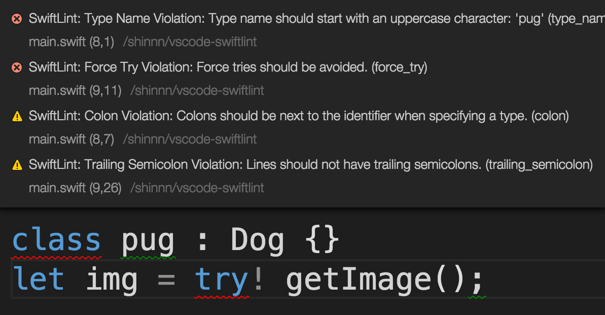

# vscode-swiftlint

[](https://david-dm.org/shinnn/vscode-swiftlint)
[](https://david-dm.org/shinnn/vscode-swiftlint#info=devDependencies)

A [Visual Studio Code](https://code.visualstudio.com/) extension to lint [Swift](https://developer.apple.com/swift/) with [SwiftLint](https://github.com/realm/SwiftLint):

> enforce Swift style and conventions, loosely based on
[GitHub's Swift Style Guide](https://github.com/github/swift-style-guide)



## Installation

1. Ensure `swiftlint` binary is [installed](https://github.com/realm/SwiftLint#installation).
2. Run [`Install Extension`](https://code.visualstudio.com/docs/editor/extension-gallery#_install-an-extension) command from [Command Palette](https://code.visualstudio.com/Docs/editor/codebasics#_command-palette).
3. Search and choose `swiftlint`.

See the [extension installation guide](https://code.visualstudio.com/docs/editor/extension-gallery) for details.

## Usage

Enable the linter in the VS Code [settings](https://code.visualstudio.com/docs/customization/userandworkspace).

```json
{
  "swiftlint.enable": true
}
```

You can also configure SwiftLint by adding a [`.swiftlint.yml`](https://github.com/realm/SwiftLint#configuration) file to the workspace directory.

## License

Copyright (c) 2015 [Shinnosuke Watanabe](https://github.com/shinnn)

Licensed under [the MIT License](./LICENSE).
